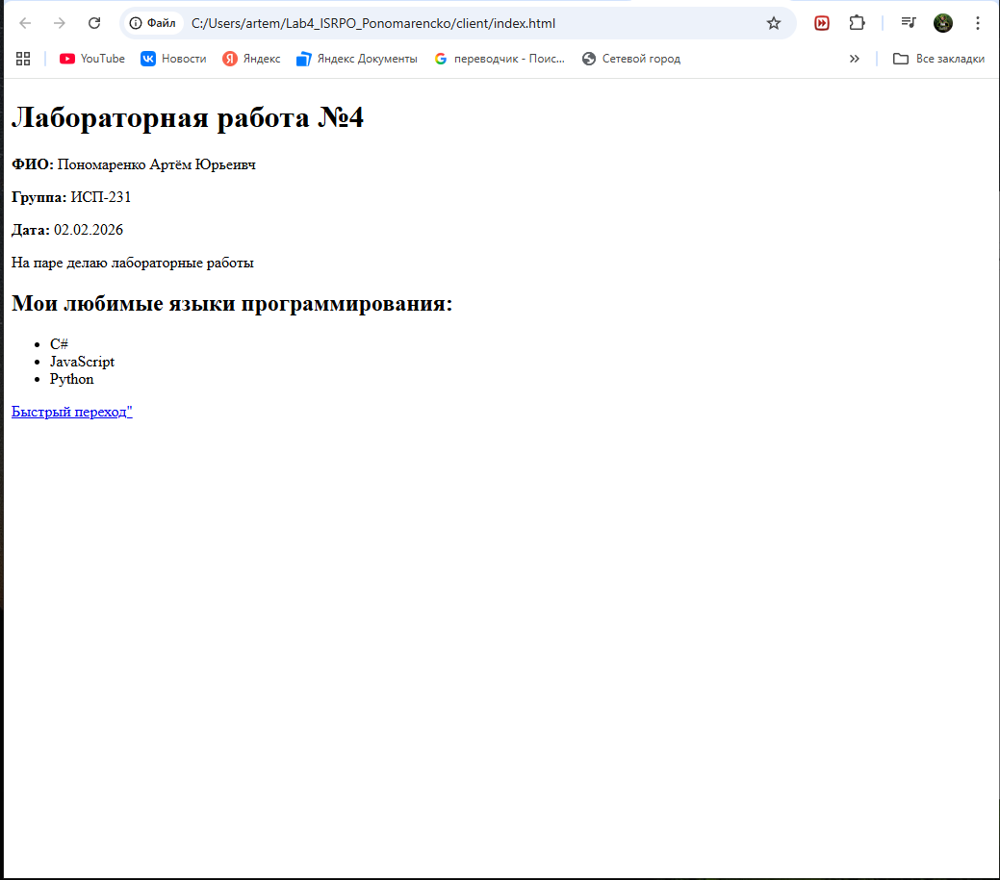
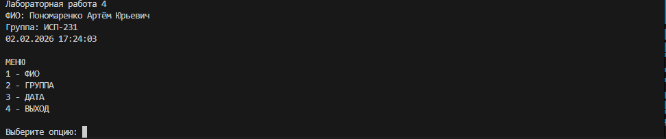
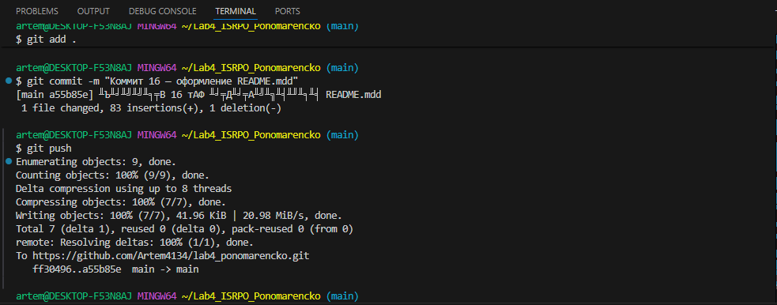

# Лабораторная работа №4

**ФИО:** Пономаренко Артём Юрьевич 
**Группа:** ИСП-231  
**Дата:** 02.02.2026

## Описание проекта
Данный проект демонстрирует навыки работы с Git, Markdown, терминалом и проектной структурой. Проект включает frontend, backend, документацию и практику работы с командной строкой.

## Содержание
1. [Структура проекта](#структура-проекта)
2. [Frontend](#frontend)
3. [Backend](#backend)
4. [Примеры Markdown](#примеры-markdown)
5. [Примеры LaTeX](#примеры-latex)
6. [Скриншоты](#скриншоты)
7. [Заключение](#заключение)

## Структура проекта
\```
Lab4_ISRPO_Ponomarencko/
├── client/
│   ├── index.html
│   └── about.html
├── server/
│   ├── Program.cs
│   └── Lab4_Server.csproj
├── docs/
│   └── markdown_examples.md
├── terminal_practice/
│   ├── logs/
│   └── data/
├── repo/
│   ├── browser_Ponomarencko.png
│   ├── backend_Ponomarencko.png
│   ├── terminal_Ponomarencko.png
│   └── git_Ponomarenko.png
└── README.md
\```

## Frontend
Простая веб-страница с информацией о лабораторной работе и о себе.

## Backend
Консольное приложение на C# с меню для отображения информации.

## Примеры Markdown

### Заголовок
# Заголовок H1

### Список
- Пункт 1
- Пункт 2

### Картинка


### Код
\```csharp
Console.WriteLine("Hello, World!");
\```

## Примеры LaTeX
Площадь круга: $S = \pi r^2$

Формула суммы арифметической прогрессии:

$$
\sum_{i=1}^n i = \frac{n(n+1)}{2}
$$

## Скриншоты
[Ссылка на репозиторий GitHub](https://github.com/Artem4134/lab4_ponomarencko.git)






## Заключение
В ходе выполнения лабораторной работы были закреплены навыки работы с Git, Markdown, терминалом и проектной структурой. Все требования выполнены в полном объеме.

